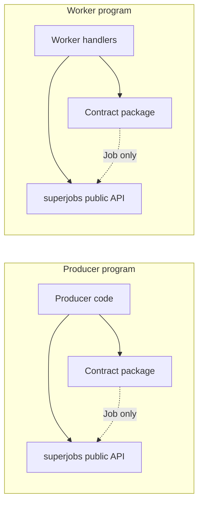

# Contract package and handler interface

**Status:** Confirmed by the maintainer on 2026-09-29 as the resolution of [issue #4](https://github.com/vschroeter/superjobs/issues/4). The examples specify the selected target interface; implementation proceeds in bounded follow-up tickets, starting with [issue #6](https://github.com/vschroeter/superjobs/issues/6).

**Update, 2026-10-01:** The async producer submission and `SubmitOptions` interface below is implemented. Its measured behavior, public typing examples, and remaining base-`Job[...]` annotation limit are recorded in [producer-interface-verification.md](producer-interface-verification.md). Later sections retain the original design sequence where they describe implemented features as pending.

Related: [issue #5](https://github.com/vschroeter/superjobs/issues/5) (verification layout), [issue #6](https://github.com/vschroeter/superjobs/issues/6) (`JobOutcome` typing), [issue #7](https://github.com/vschroeter/superjobs/issues/7) (handler registration), [issue #8](https://github.com/vschroeter/superjobs/issues/8) (constructor forwarding and SubmitOptions), and [issue #9](https://github.com/vschroeter/superjobs/issues/9) (strict validation before construction). Runnable sketch: `examples/contract_interface/`. Measured typing today: `docs/research/typing-baseline.md`, `examples/contract_interface/typing/`. Research: [contract convenience typing](../research/contract-convenience-typing.md), [contract fingerprint detection](../research/contract-fingerprint-detection.md).

The design/examples/outcome slice is committed as `b75616a`. Registration forms and complete decorator signatures are implemented locally and verified in [handler registration evidence](handler-registration-verification.md). One explicit no-request registration overload remains a measured static gap, so #7 is still open. A [bounded subtype prototype](../research/producer-subtype-typing-probe.md) for constructor forwarding, omitted-slot inference and optional SubmitOptions proves ordinary DTO cases and exposes remaining compatibility limits in #8. Production keyword construction depends on the strict validation boundary in #9. The target examples below do not imply those producer features have shipped.

## Goal

Producers import a **contract package** (Job definitions and payload types) and the public SuperJobs API without worker modules. Workers register handlers against the same Job constants and always receive a typed execution context. Domain terms: `CONTEXT.md`.

## Shared contract example

Payload types and Job constants are shared by producers and workers (generics inferred from `request` / `result` / `event` types):

```python
from dataclasses import dataclass

from superjobs import Job


@dataclass(kw_only=True, frozen=True)
class GenerateManifestRequest:
    device_id: str


@dataclass(kw_only=True, frozen=True)
class GenerateManifestResult:
    manifest_id: str


@dataclass(kw_only=True, frozen=True)
class GenerateManifestEvent:
    stage: str


generate_manifest = Job(
    "examples.contract.generate_manifest",
    version="v1",
    request=GenerateManifestRequest,
    result=GenerateManifestResult,
    event=GenerateManifestEvent,
)
```

## Target behavior (selected)

### Job contracts and payloads

Omitted `request=`, `result=`, or `event=` on a Job means **no corresponding payload**, not an unspecified generic. Inference on **Python 3.12** should supply `None` for omitted slots without manual `Job[...]` annotations in examples.

| Case | Request | Final result | Intermediate events | Producer |
| --- | --- | --- | --- | --- |
| Manifest with events | typed | typed | typed | `submit(GenerateManifestRequest(...))` or keywords |
| Manifest without events | typed | typed | none | `submit(...)` |
| Telemetry ingest | typed | none | none | `submit(TelemetrySample(...))` |
| Heartbeat | none | typed | none | `submit()` or options only |

**No request:** `submit()` or an options object alone; handler `(context,)`. **No result:** handler **must** return `None`; `await handle.result()` yields `None` while execution outcomes (success, failure, cancellation) remain observable via outcome APIs (see issue #6 for typed outcome follow-up). **No events:** application `emit` of intermediate events is forbidden; logs, progress, and system observations remain.

Nullable **fields** inside a declared request type are **supported**. That is separate from omitting the request **slot** on the Job (`request=None`). A future extension could add a nullable **whole-request** type (optional request payload with a present slot); that whole-request shape is **not** selected in this draft.

### Producer submission

Both forms are in scope:

1. **Explicit request object** — `client.submit(GenerateManifestRequest(device_id="sensor-17"), options=SubmitOptions(...))` with optional keyword-only `options` (proposed spelling for the object form).
2. **Constructor keywords** — `client.submit(device_id="sensor-17")`, constructing the declared request and entering the shared validation/submission path. Raw inputs are checked before construction when coercion is possible.

For keyword submission, an optional **positional-only** leading `SubmitOptions` is supported: `client.submit(SubmitOptions(timeout=5), device_id="sensor-17")`; omitted options use defaults (see below). Request business fields named `options` remain valid; execution options are not reserved keywords.

```python
handle = await client.submit(GenerateManifestRequest(device_id="sensor-17"))
result = await handle.result()  # async submit-and-wait; same connection/session as separate submit + result
handle = await client.submit(device_id="sensor-17")
handle = await client.submit(SubmitOptions(timeout=5), device_id="sensor-17")
handle = await client.submit(
    GenerateManifestRequest(device_id="sensor-17"), options=SubmitOptions(timeout=5)
)
handle = await heartbeat_client.submit()  # no-request Job; or SubmitOptions(...) alone
```

**Validation (selected):** strict by default; contract-defined explicit conversions allowed; unknown request keywords rejected. Validate before model construction when the constructor could coerce invalid input; **revalidate** explicit objects. Invalid producer input fails **before** submission. Invalid handler results become visible **failed executions**, not silent coercion.

Revalidation checks the values present at the SuperJobs boundary. It cannot recover an original value already converted by application code before an explicit request object is supplied. Mixing an explicit request object with constructor fields is rejected.

**Defaults:** preserve current behavior when options are omitted — no attempt timeout or execution deadline unless set; fresh execution and idempotency identifiers when not supplied. Do not invent undocumented deadlines.

**Sync producer convenience (selected direction):** async remains primary; add blocking helpers that mirror async submit/result on a client. **Recurring** sync use must keep transport I/O alive on an **owned background event loop** (or equivalent continuous lifecycle) between blocking calls. A **one-shot** blocking `run` may own a temporary loop for a single operation. Existing synchronous handler callbacks stay supported. **Final sync helper names are not selected** in this draft.

### Handler context and registration

Every handler takes **context**; with a request, `(request, context)`. Only **one** handler per Job may be active in a worker registry.

Registration forms are **alternatives** (separate startup examples — not three handlers on the same Job):

```python
# Startup A — runtime decorator
@jobs.handler(generate_manifest, concurrency=4, retry_policy=...)
async def on_generate_manifest(
    request: GenerateManifestRequest, context: JobContext[GenerateManifestEvent]
) -> GenerateManifestResult: ...
```

```python
# Startup B — explicit register
async def generate_manifest_impl(
    request: GenerateManifestRequest, context: JobContext[GenerateManifestEvent]
) -> GenerateManifestResult: ...
jobs.register(generate_manifest, generate_manifest_impl, concurrency=4, retry_policy=...)
```

```python
# Startup C — contract metadata (worker module only), then register
@generate_manifest.handler
async def generate_manifest_marked(
    request: GenerateManifestRequest, context: JobContext[GenerateManifestEvent]
) -> GenerateManifestResult: ...
jobs.register(generate_manifest_marked, concurrency=4, retry_policy=...)
```

Worker **concurrency** and **retry policy** are chosen at **runtime registration** (decorator or `register` kwargs), not frozen in contract metadata. All paths share **one** runtime registry and validation pipeline (no global handler discovery).

The contract-side `@generate_manifest.handler` decorator attaches Job association metadata only; it does not register globally or import worker code from the contract package. **Practical uses:** handlers live in a dedicated module while bootstrap only calls `register`; alternate worker runtimes or tests import the same contract and bind different callables. **Downsides:** an extra registration step; metadata must preserve callable types for static checks. Runtime registration remains authoritative for all three forms.

**Async-first** handlers are the primary target; sync handlers remain as today.

**Typing target:** static compatibility between `Job` and handler annotations (including context event type); decorated callable signature preserved (not widened to `(...) -> Any` to hide gaps). For no-event Jobs, context typing may use `Never` or an equivalent; this draft does **not** claim `JobContext[None]` statically forbids `emit(None)`.

### Constructor forwarding (typing)

Experimentally viable via `Callable[P, Request]` / `ParamSpec` through Job and client (see research probe). **Limits:** `P` requires `*args` and `**kwargs` together; generic keyword-only-only transformation is impossible; positional constructor convenience cannot be silently promised.

**Regular dataclasses** keep **explicit request object** submission. **Keyword constructor** submission (`client.submit(device_id=...)`) is the convenience goal. ParamSpec positional-prefix and overload edge cases must be **proved in tests before shipping**; gaps must not be papered over by erasing client or handler types to `Any`. Production proof still required: installed-wheel imports, absent-request Jobs, overload overlap, public exports, and runtime validation — probes in research are **not** library guarantees.

### Contract compatibility

**Contract fingerprint** (per Job definition, computed once, cached): distinct from **submission fingerprint** (idempotency / conflicting resubmit). Descriptor includes Job name and immutable Job version; explicit presence/absence of request, result, and event payloads; wire codec identity and wire-facing schemas; validation policy; descriptor normalization format version. Package version is diagnostic only, not part of agreement.

Equal serialized schemas do **not** prove equal Python semantics (custom validators, default factories). Semantic changes require a new Job version; automatic source hashing is not a semantic proof. Custom adapters with unknown or absent schema representation must **not** silently hash alike — bounded adapter representation is an **implementation proof**; do not claim cross-process detection without a descriptor.

**Per execution:** durable contract fingerprint travels with the submission and is stored on the execution record. Worker verifies **before** request decode and handler invocation. Clients verify **before** typed observation/result decode (including reconstructed handles). Mismatch on an accepted execution → non-retryable `contract_mismatch` failure. Submission fingerprint remains bound to the contract fingerprint in effect at submit time.

**Shared manifest (selected):** one immutable NATS KV entry per Job name/version. Atomic `create` for first registration; later producers and workers **compare**, never overwrite. First writer establishes **agreement**, not truth. Mismatch rejects producer submission and worker pool participation for that Job. Single shared load-balanced pool per Job — **no** fingerprint-based routing (routing would hide split-brain same-version contracts). KV/registry failures are visible; no silent fallback.

Exact hash normalization, canonical JSON rules, and fingerprint-format migration are **implementation follow-ups** with explicit versioning — behavior is decided; byte-level rules are not deferred as open design.

## Implementation baseline (measured before issue #6)

| Area | Baseline (Pyright basic, before issue #6) |
| --- | --- |
| `client.submit(request)` | Rejects wrong request when Job is fully specified |
| `@jobs.handler(job)` | Accepts `Job[Any, Any, Any]`; returns `(...) -> Any`; runtime checks minimum arity only |
| Omitted `event=` / `request=` / `result=` | Often `Unknown`, not `None` |
| `handle.outcome()` | `JobOutcome` without `FinalT` (issue #6) |
| Contract fingerprint / KV manifest | Not implemented |
| `jobs.register`, keyword `submit`, sync client helpers | Not implemented |

`submission_fingerprint` hashes identity, request bytes, timeout, deadline — not full contract descriptors (`docs/research/contract-fingerprint-detection.md`).

## Dependency ownership



Contract package depends on `superjobs` for `Job` only. Producers must not import worker handler modules.

## Verification (issue #5)

Required before treating typing as shipped: Pyright (or agreed checker) on positive and negative fixtures, including consumers of the **built and installed wheel** without source `extraPaths`. Commands: `examples/contract_interface/README.md`, `docs/design/contract-interface-verification.md`. Deterministic in-memory and NATS process examples remain separate transport proofs.

## Implementation slices (after #4 resolution)

Do not start library slices until issue #4 is resolved. The first small implementation ticket remains **issue #6**. Other slices below are a scope breakdown; their ordering and dependencies will be recorded separately.

1. **Issue #6** — `JobOutcome[FinalT]` and narrowing (first implementation ticket after #4 resolution; [implemented and independently verified](outcome-typing-verification.md)).
2. **Handler typing and registration** — preserve decorated signature; static Job/handler compatibility; all three registration forms and context rules above.
3. **Producer submit overloads and inference** — explicit object + `ParamSpec` keywords + optional positional `SubmitOptions` / keyword `options` on object form; absent payload inference.
4. **Sync producer lifecycle** — owned connection and continuous loop for recurring use; names TBD.
5. **Validation pipeline** — strict default, conversions, pre-construction and revalidation.
6. **Contract fingerprint** — descriptor builder, per-execution carry/compare, `contract_mismatch` outcome.
7. **NATS KV manifest** — create/compare, producer and worker gate, using the contract descriptor/fingerprint.

## Remaining implementation proofs

- Installed-wheel typing for all submit and registration forms; negative controls for wrong handler, submit, and emit.
- Runtime validation parity with static rejects (unknown fields, mixed object/keyword submit, invalid results).
- Fingerprint descriptor for dataclass and Pydantic adapters at dump/load boundary; policy for schema-less custom adapters without false equality.
- Normalized descriptor bytes and migration when normalization version increments.
- KV manifest race: first create, concurrent compare failures, visible errors when KV unavailable.
- End-to-end: mismatch after accept → non-retryable failure; producer/handle refuse typed decode on mismatch.
- Constructor overload edge cases: absent request, constructor defaults, overload overlap, request field named `options`.
- Sync client: documented behavior when called from running async code; repeated blocking use, connection reuse, and cleanup after one-shot vs persistent client.
- ParamSpec scope recorded in tests: keyword-only constructors proved before ship; positional-prefix convenience explicitly out of scope unless added later; no `Any` widening to hide failures.
